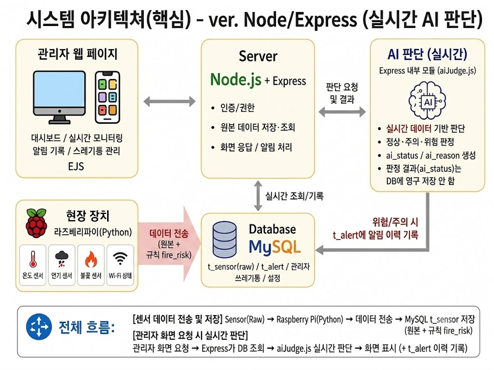
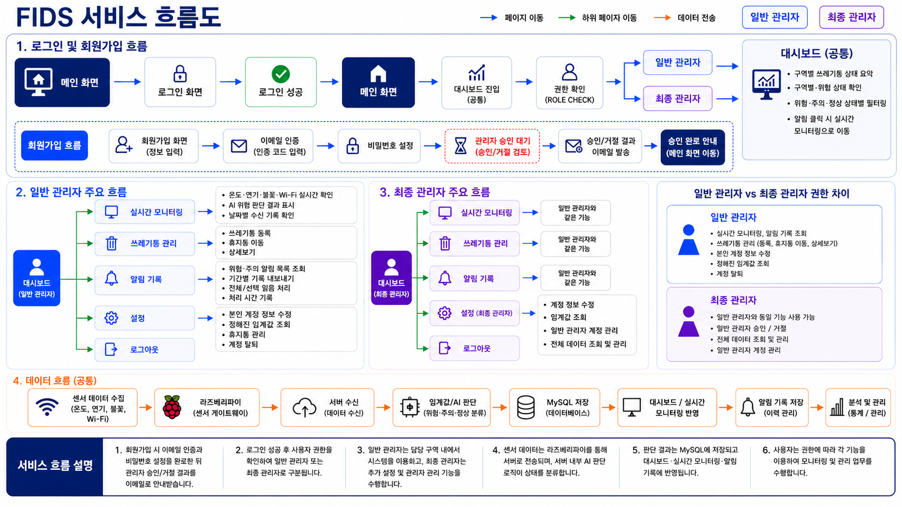
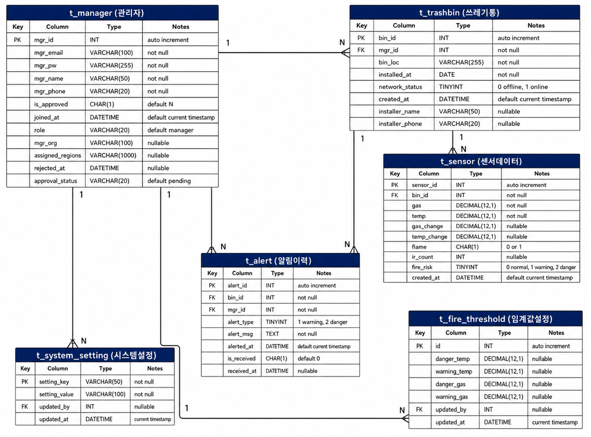
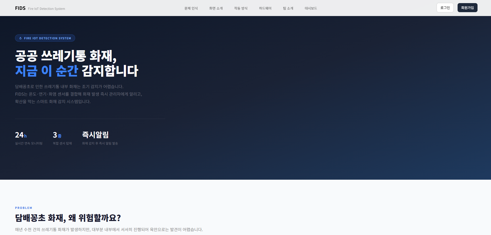
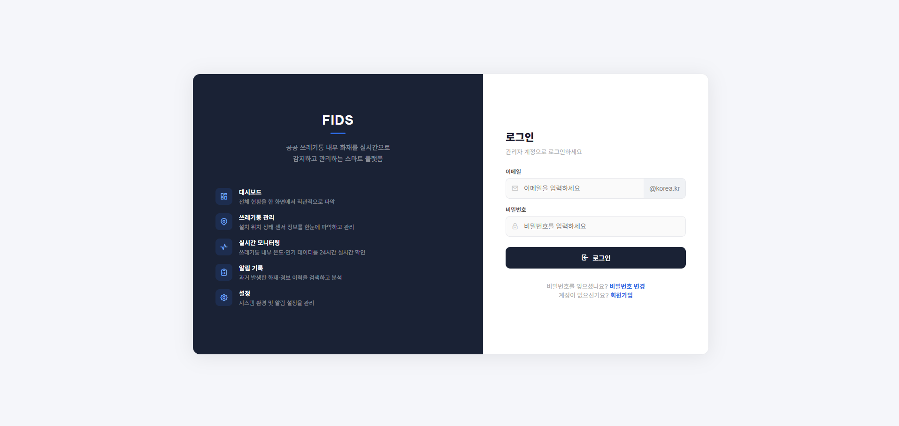
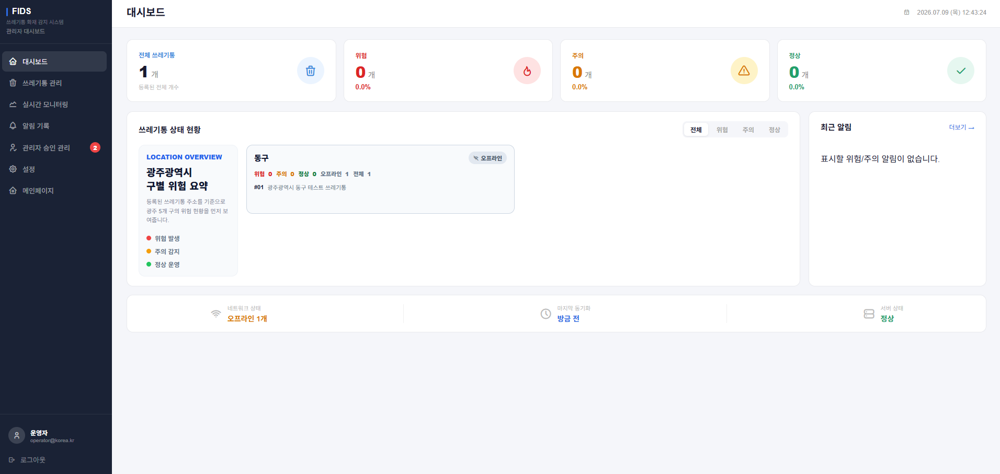
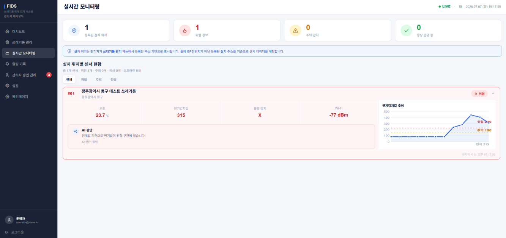
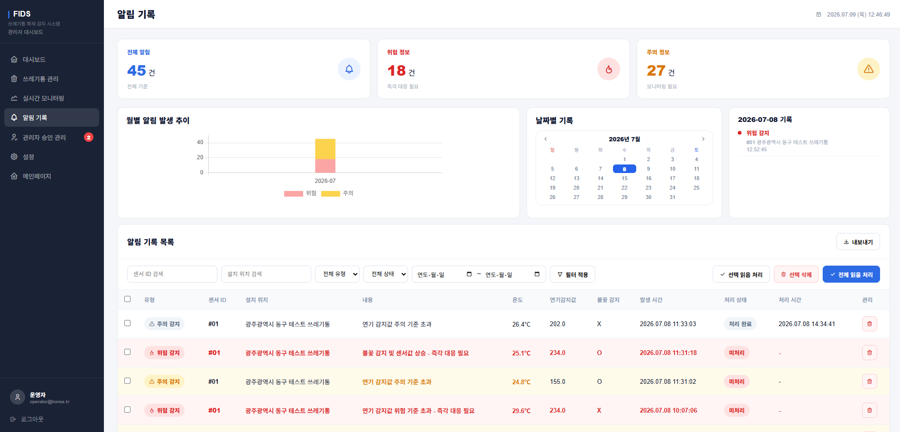
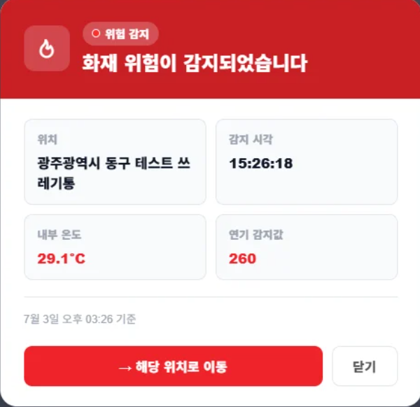
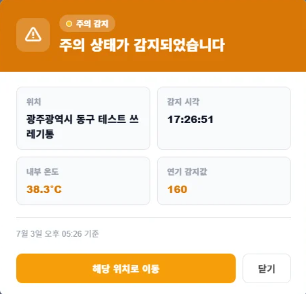

# 🔥 FIDS (Fire Ignition Detection System) 팀명: IGNIX

## 1. 프로젝트명 / 팀명

**FIDS** (Fire Ignition Detection System) — 팀명 **IGNIX**

 

## 2. 서비스 소개

* **서비스명**: FIDS - 공공 쓰레기통 화재 감지 시스템
* **서비스 설명**:
  * 담배꽁초로 인한 쓰레기통 내부 화재는 초기에 육안으로 발견하기 어려움
  * FIDS는 온도·연기·화염 센서를 결합해 화재 발생을 실시간으로 감지하고, 위험 발생 즉시 관리자에게 알려 확산을 막는 스마트 화재 감지 플랫폼
  * 수동 순찰의 인력·비용 한계를 데이터 기반으로 보완하고, 관리자가 실시간으로 위험 지역을 모니터링할 수 있도록 지원

 

## 3. 프로젝트 기간

**2026.06.22 ~ 2026.07.08** (약 3주)

 

## 4. 주요 기능

* 실시간 화재 위험 감지 (MQ-2 연기 · DS18B20 온도 · NS-FDSM-5S 불꽃 센서)
* AI 기반 위험도 판단 (정상 / 주의 / 위험 3단계, 조회 시점 실시간 계산)
* 실시간 화재 위험 알림 (위험/주의 감지 시 전체 화면 팝업 + 알림 이력 기록)
* 쓰레기통 관리 (등록 / 조회 / 삭제, 삭제 항목 휴지통 이동 및 복구)
* 관리자 권한별 대시보드 (관리자: 담당 구역 / 최고 관리자: 전체 데이터 + 승인 관리)

 

## 5. 기술스택

<table>
    <tr>
        <th>구분</th>
        <th>내용</th>
    </tr>
    <tr>
        <td>하드웨어</td>
        <td>
            
            
        </td>
    </tr>
    <tr>
        <td>센서</td>
        <td>MQ-2(연기) / DS18B20(온도) / NS-FDSM-5S(불꽃)</td>
    </tr>
    <tr>
        <td>프론트엔드</td>
        <td>
            
            
            
            
        </td>
    </tr>
    <tr>
        <td>백엔드</td>
        <td>
            
            
        </td>
    </tr>
    <tr>
        <td>데이터 분석</td>
        <td>
            
            
        </td>
    </tr>
    <tr>
        <td>데이터베이스</td>
        <td></td>
    </tr>
    <tr>
        <td>디자인/기획</td>
        <td>
            
            
        </td>
    </tr>
    <tr>
        <td>협업도구</td>
        <td>
            
            
        </td>
    </tr>
</table>

 

## 6. 시스템 아키텍처

 

## 7. 유스케이스

 

## 8. 서비스 흐름도

 

## 9. ER 다이어그램

 

## 10. 화면 구성

### 메인화면

### 로그인화면

### 대시보드

### 실시간 모니터링

### 알림 기록

### 실시간 화재 위험 알림 (위험 / 주의)
<table>
  <tr>
    <td></td>
    <td></td>
  </tr>
</table>

 

## 11. 시연 영상

https://github.com/guyejin-lab/GYJ_Portfolio/assets/demo.mp4

*(README 편집 화면에서 위 영상 파일을 직접 드래그하면 GitHub가 자동으로 재생 가능한 링크로 바꿔줘요. 그 링크를 이 자리에 붙여넣으세요.)*

 

## 12. 팀원 역할

| 구정경 | 구예진 | 장현지 | 한혜미 | 박문수 |
|---|---|---|---|---|
| 백엔드 기능 구현 | 웹 화면 설계 담당 | 자료 크롤링 | IoT 회로 설계 | 센서 기능 구현 |
| DB 요구사항 분석서 작성 | 시연 영상 편집 | 웹 화면 설계 보조 | 센서 기능 구현 | 실험 데이터 수집 |
| 테이블 명세서 작성 | 요구사항 정의서 작성 | 화면 설계서 작성 | DB연동 테스트 | 시스템 테스트 |
| MySQL DB 연동 | 플로우 차트 작성 | 회로도 제작 | 시스템 테스트 | 프로젝트 문서 작성 |
| 프로젝트 문서 최종 점검 | 기획서 작성 | 발표 PPT 제작 | | |
| | 시스템 테스트 | 시스템 테스트 | | |

 

## 13. 트러블슈팅 (가장 중요 ⭐)

| 문제 | 원인 | 해결 |
|---|---|---|
| 불꽃감지 센서가 실제 불꽃을 제대로 인식하지 못함 (종이를 태워도 반응이 약함) | 센서가 햇빛이나 조명 등 주변광에는 민감하게 반응했지만, 작은 불꽃 신호는 놓치는 경우가 있었음 | 팀에서 센서 감도를 조절해가며 반복 테스트를 진행했고, 불꽃 센서 단독 판단 대신 온도센서(DS18B20) 값을 함께 보고 교차 검증하는 방식으로 보완함 |
| 쓰레기통 내부 오염으로 인한 센서 오작동 가능성 | 쓰레기가 센서를 가리거나 먼지·이물질이 쌓여 감지 성능이 떨어질 수 있었음 | 팀에서 센서 부착 위치를 재조정하고, 오염을 최소화할 수 있는 보호 구조(커버/케이스)를 함께 고민하여 설계에 반영함 |
| 온도센서(DS18B20) 배선 연결이 불안정함 | 전선과 GPIO 핀을 직접 연결하는 방식이라 접촉이 불안정하고 쉽게 빠짐 | 팀에서 터미널 블록을 사용해 전선을 고정함으로써 연결을 안정적으로 구성함 |
| 팀원 간 의견 교환이 활발하지 않아 문제 발견 및 논의가 늦어짐 | 회의에서 먼저 말을 꺼내는 사람이 없어 센서/웹 관련 이슈가 공유되지 않고 각자 진행됨 | 정기 회의를 통해 서로 편하게 이야기할 수 있는 분위기를 만들었고, 이후 센서·웹 이슈를 팀 전체가 공유하며 문제 해결 속도가 빨라짐 |
| 요구사항 정의서와 화면 설계가 약 2주간이나 계속 변경됨 | 기획 단계에서 요구사항 범위가 명확하게 정의되지 않아 누락되거나 모호한 부분이 많았음 | 유스케이스 단위로 범위를 세분화해가며 요구사항을 반복적으로 재검토했고, 화면 설계와 병행하여 계속 맞춰보며 약 2주간의 반복 수정 끝에 요구사항과 화면 설계를 확정함 |
| 랜딩페이지 "작동 방식" 소개 문구가 실제 시스템 구조와 다르게 서술되어 있었음 | 데이터 전송 단계를 "서버로 전송"이라고 뭉뚱그려 표현했고, 판단 단계도 처음에는 규칙 기반의 "이상판단" 흐름으로 진행될 것으로 알고 있었으나, 팀 논의 중 AI 학습 기반으로 바꾸자는 의견이 나오면서 판단 로직 자체가 변경되어 기존 설명과 명칭이 실제와 달라짐 | "서버로 실시간 전송" → "데이터베이스로 실시간 전송"으로 구체화하고, "이상판단" → "AI 판단"으로 명칭을 수정하여 실제 동작과 일치하도록 정리함 |

 

## 🙋 내가(구예진) 맡은 업무

* 프로젝트 기획서 작성
* 요구사항 정의서 작성 (FIDS_000~020 유스케이스, 기능/비기능 요구사항)
* UML 유스케이스 다이어그램 설계 (Figma)
* 플로우차트 작성
* 불꽃감지 센서(NS-FDSM-5S) 실험 보조 (테스트 과정에 참여하며 설계 일부에 의견 반영)
* 온도센서(DS18B20) 관련 설계 일부 참여
* 메인 랜딩페이지 등 약 27개 화면 UI 디자인 및 퍼블리싱 (VSCode로 직접 HTML/CSS/JS 코드 작성)
* 공공데이터 기반 비즈니스 제안서 작성 (data.go.kr, 광주 5개 구 215개 쓰레기통 분석)
* 문제 인식 부분의 소방청 화재통계연감 참고 데이터 텍스트에 소방청 공식 통계 페이지 링크를 연결함
* 최종 발표 자료(Canva) 제작
* 시연 영상 편집
* 팀 회의에서 다른 팀원보다 적극적으로 의견을 내고, 소통이 어려운 분위기를 풀기 위해 먼저 말을 꺼내며 정기 회의를 제안함

 

## 💡 프로젝트를 통해 배운 점

* 센서는 단순히 연결하고 끝나는 것이 아니라, 실제 환경(빛, 먼지, 거리 등) 조건에서 반복 테스트를 거쳐야 신뢰할 수 있는 데이터를 얻을 수 있다는 것을 배웠다.
* 하나의 센서만으로 판단하기보다, 여러 센서 값을 교차 검증하는 것이 오탐/미탐을 줄이는 데 중요하다는 것을 체감했다.
* 문제가 발생했을 때 감(feeling)이 아니라 원인을 하나씩 나눠서 확인하고 좁혀가는 트러블슈팅 사고방식을 실전에서 경험했다.
* 하드웨어와 소프트웨어, 기획까지 여러 영역을 넘나들며 팀원들과 역할을 나누고 협업하는 방법을 배웠다.
* 미니 프로젝트 때는 문서 작업을 제대로 다뤄본 적이 없었는데, 이번 핵심 프로젝트를 진행하며 요구사항 정의서·기획서 등을 하나하나 작성해보면서 문서화가 프로젝트에서 얼마나 중요한 역할을 하는지 알게 됐다.
* 시연회 발표를 직접 맡으면서 처음엔 긴장을 많이 했지만, 발표 연습을 반복하는 과정에서 오히려 우리 사이트의 전체 흐름을 완전히 숙지하게 됐다. 특히 임계값 부분은 어떻게 설명해야 할지 고민이 많았는데, 계속 연습하다 보니 발표 당일에도 자연스럽게 넘어갈 수 있었고, 최종 발표 때 임계값 관련 질문이 나왔을 때도 당황하지 않고 잘 답변할 수 있었다. 이를 통해 발표 준비가 프로젝트를 한 단계 더 완성시키는 과정이라는 것을 배웠다.
* 데이터베이스 멘토링을 들으면서 멘토님께 비밀번호 같은 민감 정보는 단순 암호화가 아니라 Argon2 같은 안전한 해싱 알고리즘을 써야 한다는 조언을 들었다. 이번 프로젝트에 직접 적용하지는 못했지만, 보안에 대한 시야를 넓히는 계기가 됐다.
